> [!NOTE]
> Useful information that users should know, even when skimming content.

> [!TIP]
> Helpful advice for doing things better or more easily.

> [!IMPORTANT]
> Key information users need to know to achieve their goal.

> [!WARNING]
> Urgent info that needs immediate user attention to avoid problems.

> [!CAUTION]
> Advises about risks or negative outcomes of certain actions.

# MOVIE REVIEW WEB APPLICATION 🎥

## 📌 Índice
- [Autores](#autores)
- [Descripción](#descripción)
- [Entidades utilizadas](#entidades-utilizadas)
- [Características solicitadas](#requested-features)
- [Navegación 🧭](#navegación-)
- [Instrucciones de ejecución](#execution-instructions)
- [Diagrama de entidades 📈](#entidades-diagram-)
- [Diagrama de clases y plantillas 📈](#class-diagram-and-templates-)
- [Participación de los miembros 👥](#members-participation-)
  - [Zaira](#zaira)
  - [Manuel](#manuel)
  - [Miguel](#miguel)
  - [Carlos](#carlos)

<picture>
 <source media="(prefers-color-scheme: dark)" srcset="https://yt3.googleusercontent.com/fIUvbz0dArTYtcHqe-kn2fFTGJhIFcxo6q1MaqpDOQVd8dPXQjmrb96D1mqwzGdjW--PbaPkDmk=s900-c-k-c0x00ffffff-no-rj">
 <source media="(prefers-color-scheme: light)" srcset="https://yt3.googleusercontent.com/fIUvbz0dArTYtcHqe-kn2fFTGJhIFcxo6q1MaqpDOQVd8dPXQjmrb96D1mqwzGdjW--PbaPkDmk=s900-c-k-c0x00ffffff-no-rj">
 
</picture>

## Authors:
### Carlos Ivorra Salinas
### Manuel
### Zaira
### Miguel

## Description:
### This is a web application that we developed for "Distribuited systems" in our collegue degree. We had to develop a web application using _Spring_, _MySQL_ and _GitHub_. W
### We decided a movie rating application because movies was a common interest between ourselves.

## Entities we used

| Entity | Description |
|-----:|-----------|
|     User| 3 types: Admin, anonymous and registered. This entitie define all the types of users|
|     Movie| The movies that are available for the users to review on the application   |
|     Cast| The cast for the movies; actors, directors...       |
|     Review| 2 types: star rating and elaborated rating with a text, a date, likes...       |

# REQUESTED FEATURES
>Below there are all requests made in the project description

## NAVIGATION 🧭
>Screenshots of the main pages in the application and navigation diagram

```mermaid
graph TD;
    Home[🏠 Home Page] -->|View Movies| Movies[🎬 Movies List];
    Home -->|View Actors| Actors[🎭 Actors List];
    Home -->|View My Reviews| MyReviews[📝 My Reviews];
    Movies -->|View Movie Details| MovieDetails[📄 Movie Details];
    Movies -->|Add Movie| AddMovie[➕ Add Movie];
    MovieDetails -->|View Cast| Cast[🎭 Cast Details];
    MovieDetails -->|Watch Trailer| Trailer[▶️ Watch Trailer];
    MovieDetails -->|Delete Movie| DeleteMovie[🗑️ Delete Movie];
    MovieDetails -->|Edit Movie| EditMovie[✏️ Edit Movie];
    MovieDetails -->|View Reviews| Reviews[📝 Reviews];
    MovieDetails -->|Add Review| AddReview[➕ Add Review];
    Reviews -->|Delete Review| DeleteReview[🗑️ Delete Review];
    Actors -->|Add Actor| AddActor[➕ Add Actor];
    MyReviews -->|Delete Review| DeleteMyReview[🗑️ Delete My Review];
    Home -->|Back to Home| BackHome[🏠 Back to Home];
    AddMovie -->|Back to Movies| BackToMovies[🎬 Back to Movies];
    AddActor -->|Back to Actors| BackToActors[🎭 Back to Actors];
```

    
## EXECUTION INSTRUCTIONS
>Instructions on what steps someone has to follow to be able to correctly download the repository and execute the application. Also specifying versions of java, sql, Maven... If possible the instructions must be specified on command lines, if not possible, it must be described in an interactive way

## ENTITIES DIAGRAM 📈
>It can be of the database or a UML diagram of the Java classes

> [!NOTE]
TODO: The following code will create an uncompleted entities diagram on the webpage: https://dbdiagram.io/d

### Code:
Table movies {
  id integer [primary key]
  name varchar
  argument text
  release_date date
  mark float
  platform varchar
  pegi integer
  duration integer
  origin_country varchar
  genres text [note: 'List of genres']
  prizes text [note: 'List of prizes won']
}

Table cast {
  id integer [primary key]
  name varchar
  biography text
  birth_date date
  work_field varchar [note: 'Actor, director, etc.']
  origin_country varchar
  awards text [note: 'List of awards']
}

Table users {
  id integer [primary key]
  username varchar
  password varchar
  email varchar
  profile_picture varchar
  role varchar [note: 'Anonymous, Registered, Admin']
  created_at timestamp
}

Table reviews {
  id integer [primary key]
  user_id integer [ref: > users.id]
  movie_id integer [ref: > movies.id]
  type varchar [note: 'Rating or full review']
  rating float
  title varchar [note: 'Only if full review']
  body text [note: 'Only if full review']
  likes integer [default: 0]
  created_at timestamp
}

## CLASS DIAGRAM AND TEMPLATES 📈
>Diagram of the application classes. Must specify what classes are "@Controller,
@Service, Repository, domain classes (entidades) or other types. In this diagram we also have to include templates and specify with what @Controller are they related to. It can be differenced with colours (Like in the page 11 of the project description)

# MEMBERS PARTICIPATION 👥
>Description of every member participation on the project

## ZAIRA
## DESCRIPTION OF THE TASKS DONE ✍️
>Add description here

## 5 most relevant commits ⬆️
| Rank | Commit |
|-----:|-----------|
|     1| Commit example|
|     2| Commit example |
|     3| Commit example |
|     4| Commit example|
|     5| Commit example        |

## 5 files in wich I have participated the most 📝
| Rank | File link |
|-----:|-----------|
|     1| file link example|
|     2| file link example |
|     3| file link example |
|     4| file link example|
|     5| file link example        |

## MANUEL
## DESCRIPTION OF THE TASKS DONE ✍️
>Add description here

## 5 most relevant commits ⬆️
| Rank | Commit |
|-----:|-----------|
|     1| Commit example|
|     2| Commit example |
|     3| Commit example |
|     4| Commit example|
|     5| Commit example        |

# 5 files in wich I have participated the most 📝
| Rank | File link |
|-----:|-----------|
|     1| file link example|
|     2| file link example |
|     3| file link example |
|     4| file link example|
|     5| file link example        |

## MIGUEL
## DESCRIPTION OF THE TASKS DONE ✍️
>Add description here

## 5 most relevant commits ⬆️
| Rank | Commit |
|-----:|-----------|
|     1| Commit example|
|     2| Commit example |
|     3| Commit example |
|     4| Commit example|
|     5| Commit example        |

## 5 files in wich I have participated the most 📝
| Rank | File link |
|-----:|-----------|
|     1| file link example|
|     2| file link example |
|     3| file link example |
|     4| file link example|
|     5| file link example        |

## CARLOS
# DESCRIPTION OF THE TASKS DONE ✍️
>Add description here

## 5 most relevant commits ⬆️
| Rank | Commit |
|-----:|-----------|
|     1| Commit example|
|     2| Commit example |
|     3| Commit example |
|     4| Commit example|
|     5| Commit example        |

## 5 files in wich I have participated the most 📝
| Rank | File link |
|-----:|-----------|
|     1| file link example|
|     2| file link example |
|     3| file link example |
|     4| file link example|
|     5| file link example        |

